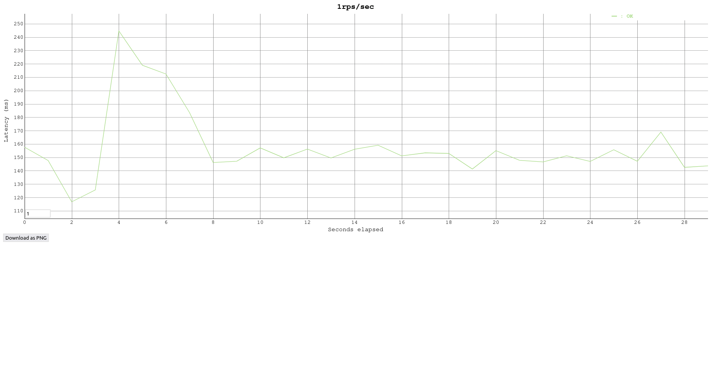
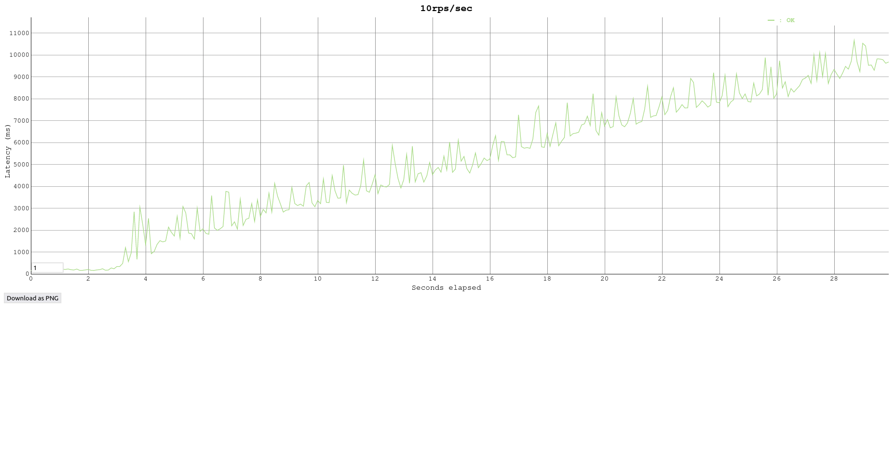
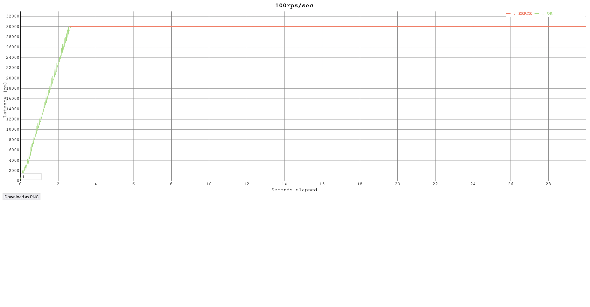
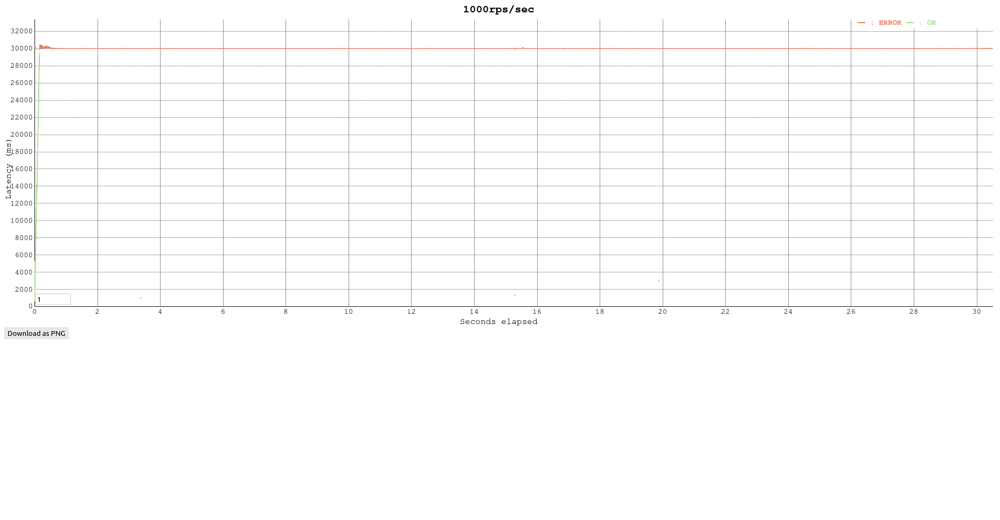
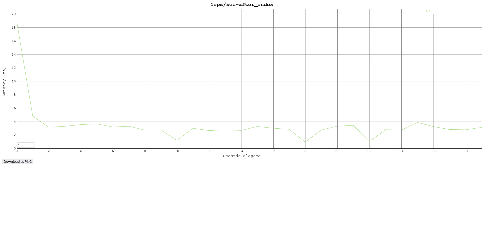
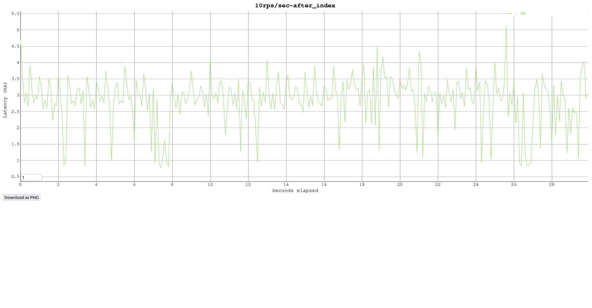
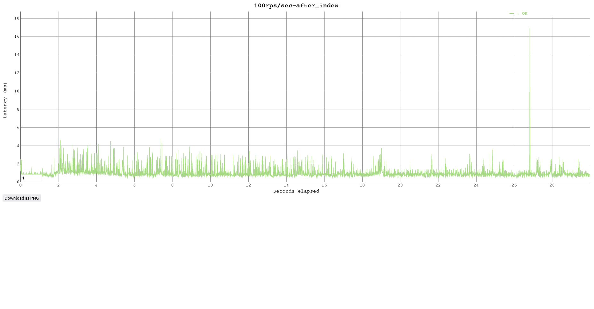
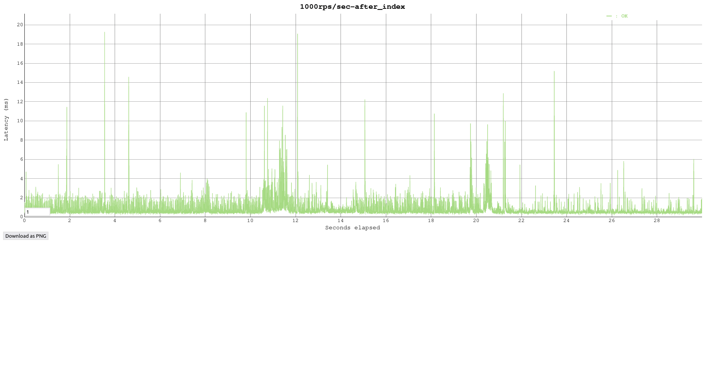

## Нагрузочное тестирование на ручку get_users

Для тестирования использовалась https://github.com/tsenart/vegeta  

Нагрузка давалась в течении 30 секунд (1000 коннектов).

rate - количество запросов в секунду.
### До добавления индекса
| *          | rate=1 | rate=10 | rate=100* | rate=1000** |
|------------|--------|---------|-----------|-------------|
| throughput | 1      | 7.58    | 4.45      | 2.69        |
| 50q        | 151ms  | 5.2s    | 28.9s     | 30s         |
| 95q        | 219ms  | 9.6s    | 30s       | 30s         |
| 99q        | 244ms  | 10.2s   | 30s       | 30s         |

| * - При нагрузке 100 rps/sec коннекты быстро забиваются
(не успевают отвечать) и получаем только **8.9%** успешных запросов.

| ** - При нагрузке 1000 rps/sec коннекты забиваются ещё быстрее 
(не успевают отвечать) и получаем только **0.59%** успешных запросов.






### После добавления составного индекса

```sql
CREATE INDEX full_name_idx ON users (lower(first_name) text_pattern_ops, lower(second_name) text_pattern_ops);
```
После добавления индекса проверяем что попадаем в него.
```bash
explain select first_name, second_name, date_birth from users
where lower(first_name) LIKE 'ал' || '%' AND lower(second_name) LIKE 'см'|| '%' order by id;
                                                                                    QUERY PLAN                                                                                     
-----------------------------------------------------------------------------------------------------------------------------------------------------------------------------------
 Sort  (cost=111.71..111.77 rows=25 width=76)
   Sort Key: id
   ->  Index Scan using full_name_idx on users  (cost=0.42..111.12 rows=25 width=76)
         Index Cond: ((lower(first_name) ~>=~ 'ал'::text) AND (lower(first_name) ~<~ 'ам'::text) AND (lower(second_name) ~>=~ 'см'::text) AND (lower(second_name) ~<~ 'сн'::text))
         Filter: ((lower(first_name) ~~ 'ал%'::text) AND (lower(second_name) ~~ 'см%'::text))
(5 rows)

Time: 1.147 ms
```
Используем составной индекс по полям `first_name` и `second_name` т.к. поиск происходит только по полям вместе.

| *          | rate=1 | rate=10 | rate=100 | rate=1000 |
|------------|--------|---------|----------|-----------|
| throughput | 1      | 10      | 100      | 1000      |
| 50q        | 3ms    | 3ms     | 1ms      | 0.5ms     |
| 95q        | 4.8ms  | 3.9ms   | 2.5ms    | 1.8ms     |
| 99q        | 19ms   | 4.4ms   | 3.3ms    | 3.5ms     |






----------
**Итог:** Составной индекс значительно ускорил скорость ответа ручки за счёт ускорения запроса.
Поиск по такому индексу поддерживает только like по постфиксу (`LIKE 'abc%'`). Для поиска по префиксу и постфиксу
можно попробовать поиск по тиграмам https://www.postgresql.org/docs/15/pgtrgm.html
