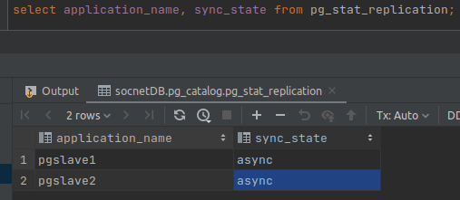
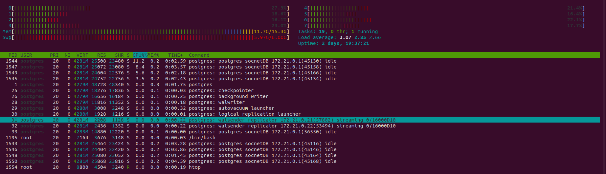
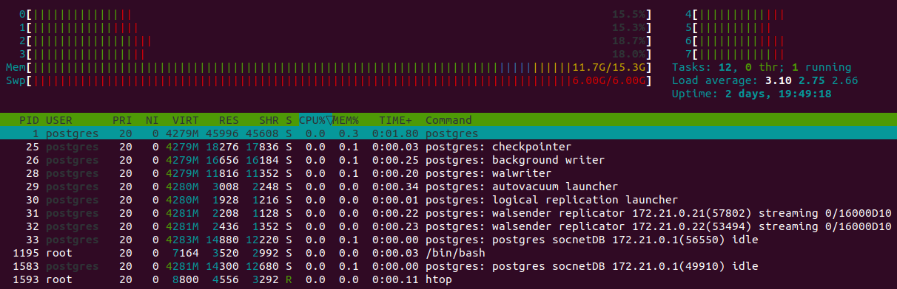
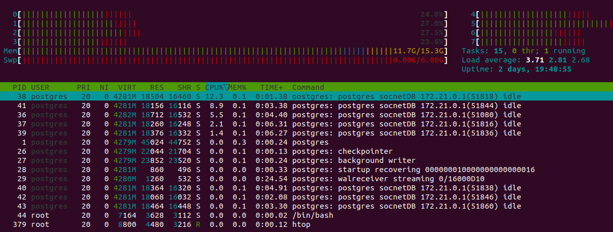
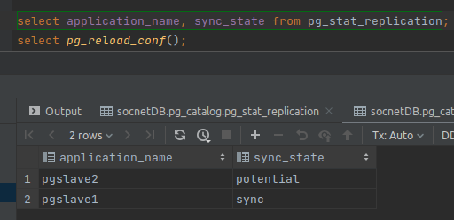
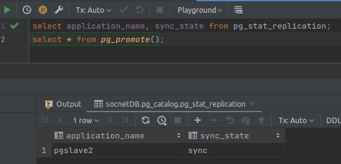

### Настройка репликации

1. Изменим в `postgresql.conf` на мастере следующую строчку
```
wal_level = replica
```
2. Подключаемся к мастеру и создаем пользователя для репликации

```
docker exec -it pg15-master su - postgres -c psql
create role replicator with login replication password 'pass';
```

3. Добавляем запись (подсеть) в `pg_hba.conf` и перезагружем postgres
```
host    replication  replicator  172.21.0.0/24  md5
```

4. Делаем бэкап с которого будем восстанавливать слейвы и копируем в папку проекта в 2 папки (для 2 реплик)
```
docker exec -it pg15-master bash
mkdir /pgslave
pg_basebackup -h pg15-master -D /pgslave -U replicator -v -P --wal-method=stream

docker cp pg15-master:/pgslave dockers/pgslave1
docker cp pg15-master:/pgslave dockers/pgslave2
```
5. Создадим файл, чтобы реплики узнали, что они реплика
```bash
touch ./dockers/pgslave1/standby.signal
touch ./dockers/pgslave2/standby.signal
```
6. Меняем postgresql.conf на репликах чтобы понимать какой хост мастер (даём разные имена)
```
primary_conninfo = 'host=pg15-master port=5432 user=replicator password=pass application_name=pgslave1'
primary_conninfo = 'host=pg15-master port=5432 user=replicator password=pass application_name=pgslave2'
```

7. Добавляем в docker-compose (см. корень проекта) новые хосты
   где будем разворачивать реплики `pg15-slave1` и `pg15-slave2` и подцепляем скопированные выше папки (volumes)
```yaml
  postgres-slave1:
    container_name: pg15-slave1
    image: postgres:15.2
    environment:
      PGDATA: "/var/lib/postgresql/data/pgdata"
      POSTGRES_DB: "socnetDB"
      POSTGRES_USER: "postgres"
      POSTGRES_PASSWORD: "postgres"
    volumes:
      - ${PWD}/dockers/pgslave1:/var/lib/postgresql/data/pgdata:rw
      - ${PWD}/dockers/pgslave1:/docker-entrypoint-initdb.d
    ports:
      - "15432:5432"
    networks:
      socnet_network:
        ipv4_address: 172.21.0.21

  postgres-slave2:
    container_name: pg15-slave2
    image: postgres:15.2
    environment:
      PGDATA: "/var/lib/postgresql/data/pgdata"
      POSTGRES_DB: "socnetDB"
      POSTGRES_USER: "postgres"
      POSTGRES_PASSWORD: "postgres"
    volumes:
      - ${PWD}/dockers/pgslave2:/var/lib/postgresql/data/pgdata:rw
      - ${PWD}/dockers/pgslave2:/docker-entrypoint-initdb.d
    ports:
      - "25432:5432"
    networks:
      socnet_network:
        ipv4_address: 172.21.0.22
```

8. Делаем запрос с мастера и проверяем что у нас появилось 2 реплики


9. Переписываем логику для чтения гет ручек с `pg15-slave1`, запускаем нагрузку до переноса и 
после чтобы убедиться что нагрузка пошла на реплику

До переноса, вся нагрузка идёт на мастер


После переноса нагрузка с мастера снята


и перенесена на слейв


10. Настроим кворумную синхронную репликацию, добавляем в conf файл на мастере следующие настройки
```
synchronous_commit = on
synchronous_standby_names = 'FIRST 1 (pgslave1,pgslave2)'
```
и перезапускаем конфиг `select pg_reload_conf();`

проверяем


11. Создаём пишущую нагрузку во время которой убиваем мастер, запись останавливается. 
Можем переключиться на `pgslave1` без потери данных т.к. он у нас синхронный значит потерь данных не будет

промоутим его до мастера
```
synchronous_commit = on
synchronous_standby_names = 'FIRST 1 (pgslave2)'
```

и переключаем на него `pgslave2`
```
primary_conninfo = 'host=pg15-slave1 port=5432 user=replicator password=pass application_name=pgslave2'
```

проверяем
